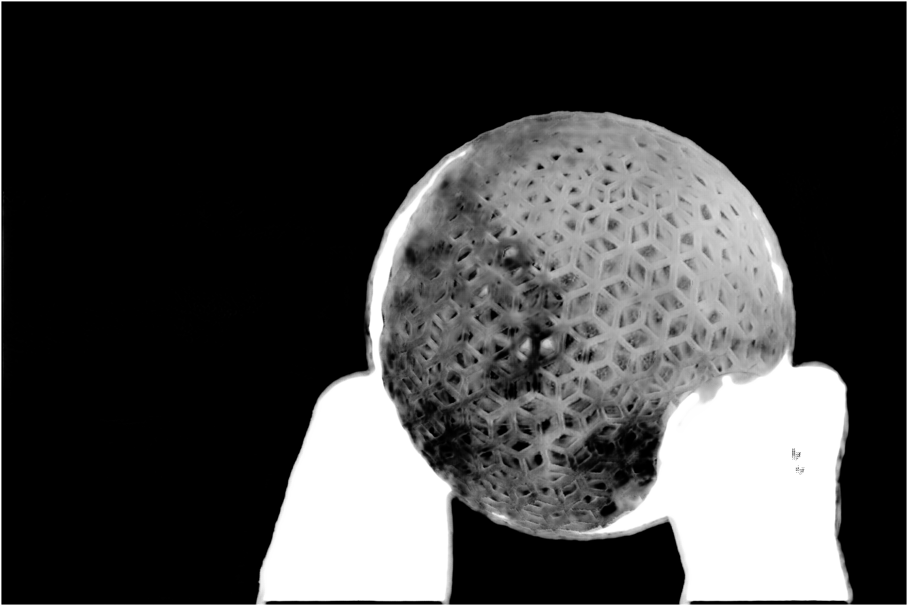
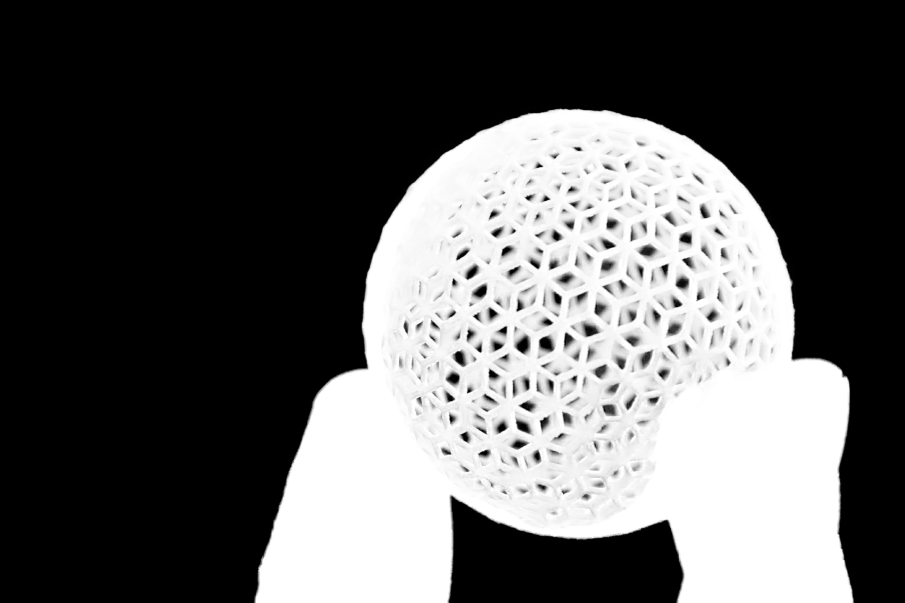
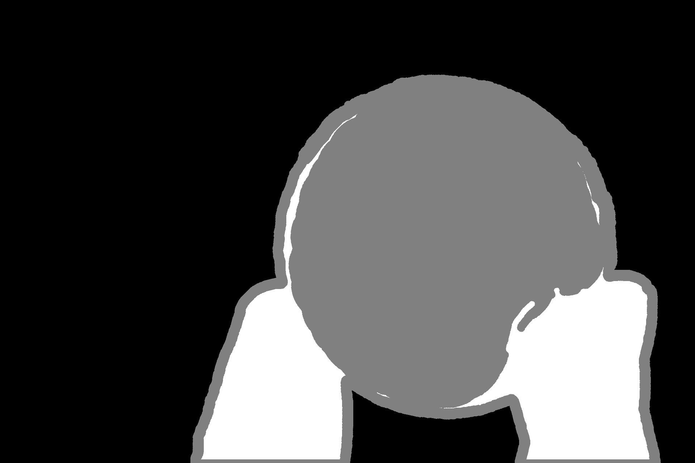

# AlphaGAN

    

This project is a repo of [AlphaGAN: Generative adversarial networks for natural image matting](https://arxiv.org/pdf/1807.10088.pdf) published at the BMVC 2018. As for now, the result of my experiment is not as good as the paper's.

The chinese verison [README](README_c.md)

# Dependencies

- Python 3
- Pytorch 0.4
- visdom 0.1.8.5
- OpenCV

# Dataset

## Adobe Deep Image Matting Dataset

Follow the [instruction](https://sites.google.com/view/deepimagematting) to contact the author for the dataset

You might need to follow the method mentioned in the **Deep Image Matting** to generate the trimap using the alpha mat. Here is a algorithm written by someone.

```python
import numpy as np
import cv2 as cv

def generate_trimap(alpha):
    fg = np.array(np.equal(alpha, 255).astype(np.float32))
    # fg = cv.erode(fg, kernel, iterations=np.random.randint(1, 3))
    kernel = cv.getStructuringElement(cv.MORPH_ELLIPSE, (3, 3))
    unknown = np.array(np.not_equal(alpha, 0).astype(np.float32))
    unknown = cv.dilate(unknown, kernel, iterations=np.random.randint(1, 20))
    trimap = fg * 255 + (unknown - fg) * 128
    return trimap.astype(np.uint8)

```

The Dataset structure in my project

```Bash
Train
  ├── alpha  # the alpha ground-truth
  ├── bg     # the background image
  ├── fg     # the foreground image
  ├── input  # the real image composed by the fg & bg
  ├── trimap # the trimap
```

# Train & Test

If your project and dataset has the same structure as mine, you could just run the code like below. 

```Bash
python alphaGAN_train.py
```
You need to specified the dataroot and the folder to save your model

```Bash
python alphaGAN_train.py --dataroot ${your_dataroot} --save_dir ${your_modelroot}

```

If you want to visualize the training process, you need to start the visdom first. 

```Bash

python -m visdom.server

```

The visualization is set to be True by default. You can disable the visualization by

```Bash
python alphaGAN_train.py --visual 0
```

For more details
```Bash

python alphaGAN_train.py --help

```

# Acknowledgments

My code is inspired by:

- [pytorch-CycleGAN-and-pix2pix](https://github.com/junyanz/pytorch-CycleGAN-and-pix2pix)

- [pytorch-book](https://github.com/chenyuntc/pytorch-book) chapter7 generate anime head portrait with GAN

- [pytorch-deeplab-xception](https://github.com/jfzhang95/pytorch-deeplab-xception)

# Test Result

Although I train this network with the fixed size input(320*320), it can still process different size of images.

### The testing result after 15 epoch




### After 35 epoch


### Ground-truth



### Trimap

